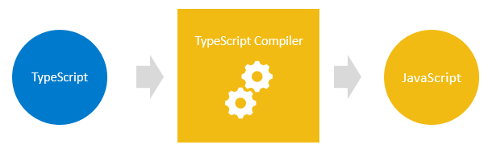

# Que es TypeScript?

## Introducción a TypeScript

TypeScript es un súper conjunto de JavaScript.

TypeScript se basa en JavaScript. En primer lugar, escriba el código TypeScript. A continuación, compile el código TypeScript en código JavaScript sin formato mediante un compilador TypeScript.

Una vez que tenga el código JavaScript sin formato, puede implementarlo en cualquier entorno que ejecute JavaScript.

Los archivos TypeScript utilizan la extensión **.ts** en lugar de la extensión **.js** de los archivos JavaScript.ts

TypeScript usa las sintaxis de JavaScript y agrega sintaxis adicionales para admitir tipos.

Si tiene un programa JavaScript que no tiene ningún error de sintaxis, también es un programa TypeScript. Significa que todos los programas JavaScript son programas TypeScript. Esto es muy útil si va a migrar una base de código JavaScript existente a TypeScript.

El siguiente diagrama muestra la relación entre TypeScript y JavaScript:

Por qué TypeScript
Los principales objetivos de TypeScript son:

- Introducir tipos opcionales en JavaScript.

- Implemente características planificadas de JavaScript futuro, también conocido como ECMAScript Next o ES Next al JavaScript actual.

### 1) TypeScript mejora su productividad al tiempo que ayuda a evitar errores

Los tipos aumentan la productividad al ayudarlo a evitar muchos errores. Mediante el uso de tipos, puede detectar errores en tiempo de compilación en lugar de que se produzcan en tiempo de ejecución.

La siguiente función suma dos números **x** e **y**:

    function add(x, y) {
    return x + y;
    }

Si obtiene los valores de los elementos de entrada HTML y los pasa a la función, puede obtener un resultado inesperado:

    let result = add(input1.value, input2.value);
    console.log(result); // result of concatenating strings

Por ejemplo, si los usuarios introducen 10 y 20, la función add() devolverá 1020, en lugar de 30.

La razón es que input1.value y input2.value son cadenas, no números. Cuando se utiliza el operador + para sumar dos cadenas, se concatenan en una sola.

Cuando se utiliza TypeScript para especificar explícitamente el tipo de los parámetros como este:

    function add(x: number, y: number) {
    return x + y;
    }

Al invocar la función de la siguiente manera:

    let resultado = add(entrada1.valor, entrada2.valor);

... el compilador de TypeScript emitirá un error si compilas el código TypeScript en JavaScript. Por lo tanto, puede evitar que se produzca el error en tiempo de ejecución.

### 2) TypeScript trae el JavaScript del futuro al presente

TypeScript es compatible con las próximas características previstas en el ES Next para los motores JavaScript actuales. Esto significa que puedes utilizar las nuevas características de JavaScript antes de que los navegadores web (u otros entornos) las soporten completamente.

Cada año, el TC39 publica varias características nuevas para ECMAScript, que es el estándar de JavaScript. Las propuestas de características suelen pasar por cinco etapas:

- Etapa 0: Propuesta
- Fase 1: Propuesta
- Fase 2: Borrador
- Etapa 3: Candidato
- Fase 4: Finalizado

Y TypeScript generalmente soporta características que están en la etapa 3.
