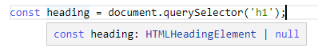
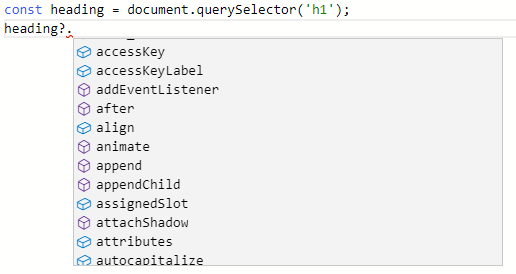
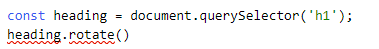

# Tipos de TypeScript

Resumen: en este tutorial, aprenderá sobre los tipos de TypeScript y sus propósitos.

## Qué es un tipo en TypeScript

En TypeScript, un tipo es una forma cómoda de hacer referencia a las diferentes propiedades y funciones que tiene un valor.

Un valor es cualquier cosa que pueda asignar a una variable, por ejemplo, un número, una cadena, una matriz, un objeto y una función.

Vea el siguiente valor:

    'Hello'

Cuando miras este valor, puedes decir que es una cadena. Y este valor tiene propiedades y métodos que tiene una cadena.

Por ejemplo, el valor ''**hello**' tiene una propiedad denominada length que devuelve el número de caracteres:

console.log('**hello**'.length); // 5
Code language: JavaScript (javascript)
También tiene muchos métodos como match(), indexOf()() y toLocaleUpperCase().match() Por ejemplo:

console.log('**hello**'.toLocaleUpperCase()); // **hello**
Code language: JavaScript (javascript)
Si observa el valor ''**hello**' y lo describe enumerando las propiedades y los métodos, sería un inconveniente.

Una forma más corta de referirse a un valor es asignarle un tipo. En este ejemplo, dices '**hello**' es una cadena. Entonces, ya sabes que puedes usar las propiedades y métodos de una cadena para el valor ''**hello**'.

En conclusión, en TypeScript:

- Un tipo es una etiqueta que describe las diferentes propiedades y métodos que tiene un valor

- Cada valor tiene un tipo.

## Tipos en TypeScript

TypeScript hereda los tipos integrados de JavaScript. Los tipos de TypeScript se clasifican en:

- Tipos primitivos
- Tipos de objeto

### Tipos primitivos

A continuación se ilustran los tipos primitivos de TypeScript:

| Nombre    | Descripción                                                                           |
| --------- | ------------------------------------------------------------------------------------- |
| string    | Representa datos de texto                                                             |
| number    | Representa valores numéricos                                                          |
| boolean   | tiene valores verdaderos y falsos                                                     |
| null      | tiene un valor: null                                                                  |
| undefined | tiene un valor: undefined. Es un valor predeterminado de una variable no inicializada |
| symbol    | representa un valor constante único                                                   |

### Tipos de objeto

Los tipos de objetos son funciones, matrices, clases, etc. Más adelante, aprenderá a crear tipos de objetos personalizados.

## Propósitos de los tipos en TypeScript

Hay dos propósitos principales de los tipos en TypeScript:

- En primer lugar, el compilador de TypeScript utiliza los tipos para analizar el código en busca de errores.
- En segundo lugar, los tipos le permiten comprender qué valores están asociados con las variables.

## Ejemplos de tipos de TypeScript

En el ejemplo siguiente se utiliza el método querySelector() para seleccionar el elemento h1:

    const heading = document.querySelector('h1');

El compilador de TypeScript sabe que el tipo de heading es HTMLHeadingElement:

Y muestra una lista de métodos del tipo HTMLHeadingElement a los que heading puede acceder:

Si intenta tener acceso a una propiedad o método que no existe, el compilador de TypeScript mostrará un error. Por ejemplo:

## Resumen

Cada valor de TypeScript tiene un tipo.
Un tipo es una etiqueta que describe las propiedades y los métodos que tiene un valor.
El compilador TypeScript utiliza tipos para analizar el código en busca de errores y errores.
