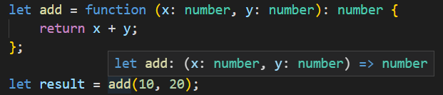

# Tipos de funciones de TypeScript

Resumen: en este tutorial, aprenderá acerca de los tipos de función TypeScript que le permiten definir tipos para funciones.

## Introducción a los tipos de función TypeScript

Un tipo de función tiene dos partes: parámetros y tipo de retorno. Al declarar un tipo de función, debe especificar ambas partes con la siguiente sintaxis:

    (parameter: type, parameter:type,...) => type

En el ejemplo siguiente se muestra cómo declarar una variable que tiene un tipo de función que acepta dos números y devuelve un número:

    let add: (x: number, y: number) => number;

En este ejemplo:

- El tipo de función acepta dos argumentos: x e y con el number de tipo.

- El tipo del valor devuelto es el number que sigue a la flecha gorda (=>) que aparece entre los parámetros y el tipo de retorno.

Tenga en cuenta que los nombres de los parámetros (x e y) son solo para fines de legibilidad. Siempre que los tipos de parámetros coincidan, es un tipo válido para la función.

Una vez anotada una variable con un tipo de función, puede asignar la función con el mismo tipo a la variable.

El compilador TypeScript hará coincidir el número de parámetros con sus tipos y el tipo devuelto.

En el ejemplo siguiente se muestra cómo asignar una función a la variable add:

    add = function (x: number, y: number) {
        return x + y;
    };

Además, puede declarar una variable y asignar una función a una variable como esta:

    let add: (a: number, b: number) => number =
    function (x: number, y: number) {
    return x + y;
    };

Si asigna otras funciones cuyo tipo no coincide con la variable add, TypeScript emitirá un error:

    add = function (x: string, y: string): number {
    return x.concat(y).length;
    };

En este ejemplo, reasignamos una función, cuyo tipo no coincide, a la variable add function.

## Inferir tipos de funciones

El compilador TypeScript puede averiguar el tipo de función cuando se tiene el tipo en un lado de la ecuación. Esta forma de inferencia de tipos se denomina tipificación contextual. Por ejemplo:

En este ejemplo, la función add tomará el tipo (x: number, y:number) => number.

Mediante el uso de la inferencia de tipos, puede reducir significativamente la cantidad de código con anotaciones.
