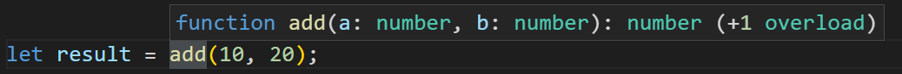

# Sobrecargas de funciones de TypeScript

Resumen: en este tutorial, aprenderá acerca de las sobrecargas de funciones en TypeScript.

## Introducción a las sobrecargas de funciones de TypeScript

En TypeScript, las sobrecargas de funciones permiten establecer la relación entre los tipos de parámetro y los tipos de resultado de una función.

**Tenga en cuenta que las sobrecargas de funciones de TypeScript son diferentes de las sobrecargas de funciones admitidas por otros lenguajes de tipo estático como C# y Java.**

Comencemos con algunas funciones simples:

    function addNumbers(a: number, b: number): number {
        return a + b;
    }

    function addStrings(a: string, b: string): string {
        return a + b;
    }

En este ejemplo:

- La función addNumbers() devuelve la suma de dos números.
- La función addStrings() devuelve la concatenación de dos cadenas.

Es posible utilizar un tipo de unión para definir un rango de tipos para los parámetros de función y los resultados:

    function add(a: number | string, b: number | string): number | string {
        if (typeof a === 'number' && typeof b === 'number')
            return a + b;

        if (typeof a === 'string' && typeof b === 'string')
            return a + b;
    }

Sin embargo, el tipo de unión no expresa la relación entre los tipos de parámetros y los resultados con precisión.

La función add() le dice al compilador que aceptará números o cadenas y devolverá un número o cadena. No describe que la función devuelve un número cuando los parámetros son números y devuelve una cadena si los parámetros son cadenas.

Para describir mejor las relaciones entre los tipos utilizados por una función, TypeScript admite sobrecargas de funciones. Por ejemplo:

    function add(a: number, b: number): number;
    function add(a: string, b: string): string;
    function add(a: any, b: any): any {
       return a + b;
    }

En este ejemplo, agregamos dos sobrecargas a la función add() La primera sobrecarga le dice al compilador que cuando los argumentos son números, la función add() debe devolver un número. La segunda sobrecarga hace lo mismo pero para una cadena.

Cada sobrecarga de función define una combinación de tipos admitidos por la función add() Describe la asignación entre los parámetros y el resultado que devuelven.

Ahora, cuando llama a la función add() el editor de código sugiere que hay una función de sobrecarga disponible como se muestra en la siguiente imagen:

